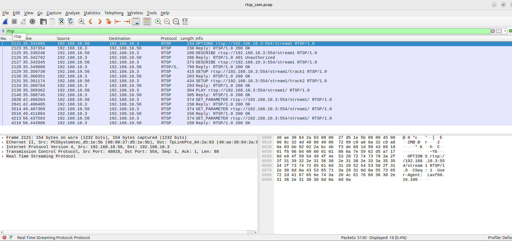
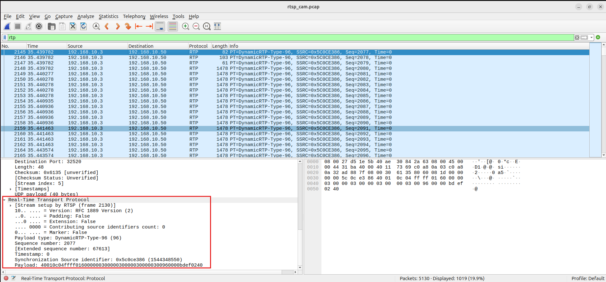
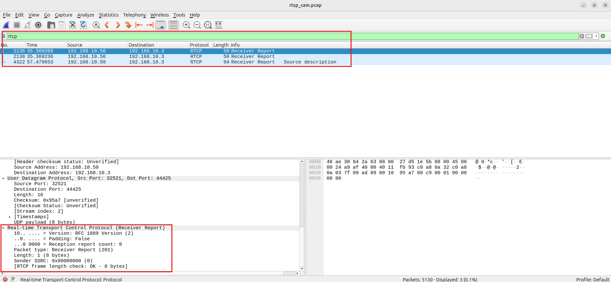

# RTSP / RTP / RTCP Packet Analysis Notes

This document summarizes a packet analysis workflow for RTSP streaming troubleshooting using tcpdump and Wireshark.

The purpose is to verify whether video stuttering is caused by network packet loss, RTSP session issues, RTP stream problems, or device-side encoding/performance behavior.

---

## Analysis Scope

The analysis focuses on the following protocols:

- RTSP: stream control
- RTP: media transport
- RTCP: stream quality feedback
- TCP / UDP: transport-layer behavior

---

## Step 1: Open the pcap File

### Display filter

No filter

### Purpose

The first step is to confirm that the packet capture contains the expected traffic.

At this stage, the goal is to review the overall packet structure before narrowing down the analysis.

### What to check

- TCP traffic
- UDP traffic
- RTSP control packets
- RTP media packets
- RTCP report packets
- Communication between the camera and the Linux client

### Notes

This is the initial sanity check to confirm that the capture was successful.

---

## Step 2: Filter by Camera IP Address

### Display filter

    ip.addr == 192.168.10.3

### Purpose

This filter removes unrelated traffic such as broadcast, DHCP, NTP, or other background network packets.

It allows the analysis to focus only on communication between the Linux client and the camera.

### What to check

- TCP connection establishment
- RTSP session setup
- UDP-based RTP stream
- RTCP packets
- Any retransmissions or unusual traffic patterns

### Notes

This step creates a clean view of the camera-related traffic.

---

## Step 3: Analyze the RTSP Session

### Display filter

    rtsp

### Purpose

RTSP is used to control the streaming session.  
This step verifies whether the RTSP session was established correctly.

### Typical RTSP flow

- OPTIONS
- DESCRIBE
- SETUP
- PLAY
- GET_PARAMETER

### What to check

- Whether the RTSP server responds with `200 OK`
- Whether `401 Unauthorized` appears during authentication
- Whether SETUP is completed for the required tracks
- Whether PLAY is issued successfully
- Whether GET_PARAMETER is used as a keepalive message

### Notes

A successful RTSP session indicates that the client and camera successfully negotiated the stream.

### RTSP Filter Example

The following screenshot shows the RTSP control flow, including OPTIONS, DESCRIBE, SETUP, PLAY, and GET_PARAMETER.

---

## Step 4: Analyze RTP Media Packets

### Display filter

    rtp

### Purpose

RTP carries the actual video and audio data.

This step checks whether the media stream is being delivered continuously and whether packet loss or sequence gaps are present.

### What to check

#### 1. RTP Sequence Number

The RTP sequence number is used to detect packet loss or missing packets.

Example of normal sequence continuity:

    Seq=2077
    Seq=2078
    Seq=2079
    Seq=2080
    Seq=2081

Example of possible packet loss:

    Seq=2077
    Seq=2078
    Seq=2079
    Seq=2081

In this example, `Seq=2080` is missing, which may indicate packet loss.

#### 2. RTP Timestamp

The RTP timestamp can be used to understand media timing behavior.

In some camera implementations, the timestamp may remain fixed or behave differently depending on the payload format and device implementation.

A sudden or irregular timestamp jump may require further investigation.

#### 3. Payload Type

Example:

    PT=DynamicRTP-Type-96

Dynamic payload type 96 is commonly used for dynamically negotiated codecs such as H.265 / HEVC.

#### 4. SSRC

SSRC identifies the RTP stream.

A sudden SSRC change may indicate:

- Stream restart
- Camera-side reset
- Session reinitialization

### Notes

If RTP sequence numbers are continuous, network packet loss is less likely to be the cause of video stuttering.

### RTP Sequence Number Example

The following screenshot shows RTP packets with continuous sequence numbers and RTP details such as payload type and SSRC.

---

## Step 5: Analyze RTCP Receiver Reports

### Display filter

    rtcp

Alternative filter:

    udp && ip.addr == 192.168.10.3 && udp.port == 5001

### Purpose

RTCP provides feedback about stream quality.

Depending on the device implementation, RTCP Receiver Reports may include quality-related information such as packet loss, jitter, and highest received sequence number.

### What to check

- Receiver Report
- Packet loss information
- Jitter
- Highest sequence number received
- Report interval and consistency

Example fields that may appear in RTCP reports:

    Fraction lost: 0
    Cumulative lost: 0
    Highest seq received: XXXX
    Jitter: X

### Notes

Some devices may send simplified RTCP Receiver Reports with limited detail.  
In that case, RTP sequence numbers should also be checked directly.

### RTCP Receiver Report Example

The following screenshot shows RTCP Receiver Report packets.

---

## Filter Summary

| Display Filter | Purpose | Main Checkpoints |
|---|---|---|
| No filter | Review the whole capture | TCP, UDP, RTSP, RTP, RTCP |
| `ip.addr == 192.168.10.3` | Focus on camera traffic | Camera-client communication |
| `rtsp` | Check RTSP control session | OPTIONS, DESCRIBE, SETUP, PLAY |
| `rtp` | Check media stream | Sequence number, timestamp, SSRC |
| `rtcp` | Check quality feedback | Receiver Report, loss, jitter |
| `udp && ip.addr == 192.168.10.3 && udp.port == 5001` | Check RTCP-related UDP traffic | Receiver Report packets |

---

## Analysis Result

The packet capture showed the following:

- RTSP session setup was successful
- RTP packets were received continuously
- RTP sequence numbers were continuous
- No RTP sequence gaps were observed
- RTCP Receiver Reports were present
- No obvious network packet loss was identified

Based on these observations, the issue was less likely to be caused by network packet loss.

If video stuttering is still observed while RTP delivery is stable, the next area to investigate would be device-side behavior, such as:

- Encoding delay
- Device CPU load
- Bitrate configuration
- Key frame interval
- Stream profile settings
- Client playback performance

---

## Technical Summary

Using tcpdump and Wireshark, RTSP streaming traffic was captured and analyzed.

The analysis focused on RTSP session setup, RTP sequence number continuity, and RTCP Receiver Reports.

The RTP sequence numbers were continuous, and no packet loss was observed in the capture.

Based on these observations, the issue was less likely to be caused by network packet loss. Further investigation should focus on device-side encoding behavior, bitrate settings, key frame interval, or client playback performance.

---

## Possible Future Improvements

- Add IO Graph analysis for visualizing packet rate changes
- Capture and compare a case where actual stuttering occurs
- Compare RTSP over UDP and RTSP over TCP
- Analyze bitrate, key frame interval, and stream profile settings
